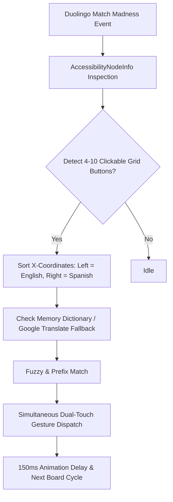

# Match Madness Bot for Duolingo ⚡

An ultra-fast, native Android Accessibility Service designed to automate Duolingo's **Match Madness** challenge with zero-latency UI inspection and simultaneous multi-touch execution.

---

## 🚀 Features

- **Zero-Latency UI Inspection**: Bypasses slow screen captures and OCR by directly inspecting native `AccessibilityNodeInfo` tree nodes (< 5ms).
- **Resolution-Independent Column Sorting**: Dynamically clusters and partitions buttons into Left (English) and Right (Spanish) columns by horizontal bounding center.
- **Simultaneous Multi-Touch Dispatch**: Uses Android's `GestureDescription` with multi-stroke gestures to tap matched word pairs concurrently (~50ms).
- **Auto-Learning Dictionary**: Pre-seeded with common vocabulary and seamlessly translates new words using background HTTP queries with in-memory caching.
- **Android 15 (API 35) Ready**: Built and validated with Gradle 9.6.0 & AGP 9.4.0.

---

## 🛠 Architecture & Workflow



---

## 📱 Installation & Setup

### Prerequisites
- Android 10+ (Tested up to Android 15)
- ADB connected (USB or Wireless)

### 1. Build and Install via ADB

```bash
cd MatchBot
./gradlew assembleDebug
adb install -r app/build/outputs/apk/debug/app-debug.apk
```

---

## ⚙️ Enabling the Accessibility Service

1. On your phone, go to **Settings → Accessibility**.
2. Tap **Downloaded apps** (or **Installed services**).
3. Find **Match Madness Bot** and toggle it **ON**.
4. Confirm the system permission dialog.

> [!TIP]
> **Android 13 / 14 / 15 "Restricted setting" notice**:
> If the toggle is greyed out:
> 1. Go to **Settings → Apps → MatchBot**.
> 2. Tap the **3-dot menu** in the top-right corner $\rightarrow$ **Allow restricted settings**.
> 3. Authenticate with your fingerprint/PIN, then return to Accessibility settings to enable the service.

---

## 🎮 How to Play

1. Open **Duolingo**.
2. Navigate to and start any **Match Madness** challenge (English on Left, Spanish on Right).
3. Sit back and watch MatchBot clear matches at superhuman speed!

---

## 🔍 Live Monitoring & Logs

Stream real-time bot operations, detected board layouts, and dictionary updates:

```bash
adb logcat -s MatchBot
```

Sample output:
```text
D/MatchBot: Service connected.
D/MatchBot: Detected board with 10 buttons.
D/MatchBot: Matched 'chinese' -> 'chino' | Dispatching simultaneous tap.
```

---

## 🔧 Customization

All bot logic lives in [`MatchBot/app/src/main/java/com/example/matchbot/MatchMadnessService.java`](MatchBot/app/src/main/java/com/example/matchbot/MatchMadnessService.java).

- **Tapping Speed / Animation Cooldown**:
  Adjust line 126:
  ```java
  handler.postDelayed(() -> isProcessing = false, 150);
  ```
  Lower values (e.g. `80–100ms`) yield faster taps; higher values (e.g. `200ms`) prevent tapping during Duolingo's fade-out animations.

- **Pre-seeding Known Vocabulary**:
  Add custom key-value pairs in `onServiceConnected()`:
  ```java
  dictionary.put("english_word", "spanish_word");
  ```
